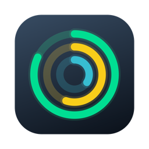
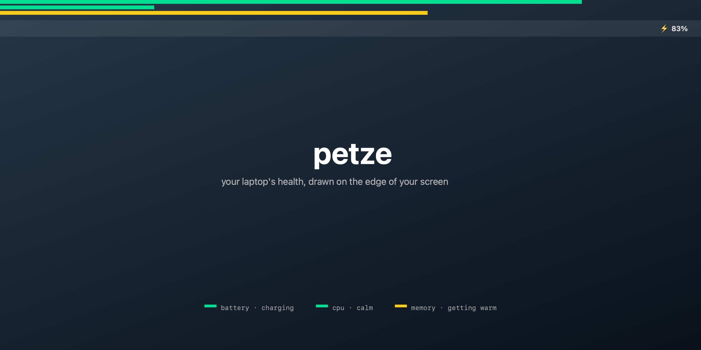
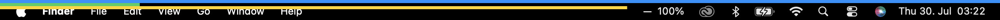

<p align="center">
  
</p>

# petze

[](https://github.com/alileza/petze/actions/workflows/ci.yml)



A tiny macOS menu bar app that shows your laptop's health as thin lines drawn
on the edge of your screen. Each line's length is the metric's level; its
color tells you how healthy it is. Lines stack from the screen edge inward:

1. **Battery** (outermost) — length = charge level
2. **CPU load** — length = total CPU usage
3. **Memory used** — length = fraction of RAM in use (active + wired + compressed)
4. **Network in / out** — log-scaled throughput (each quarter of the line is
   one decade, 10 KB/s → 100 MB/s)

## Display modes

**Automatic** (default) shows only what matters right now — on a quiet machine
that's a single memory line. Other lines appear when they have something to
say and retract when the moment passes:

- **Battery** appears while charging, or when discharging below ~40%
- **CPU** appears when load crosses 60%, retracts once it calms below 45%
- **Network** lines appear above ~500 KB/s sustained, retract below 100 KB/s

Entry and exit thresholds differ (hysteresis) so lines don't flicker at the
boundary.

**Manual** lets you pin exactly the lines you want, from the menu bar icon.

## Hover for numbers

Move the cursor to the line strip and a small tooltip shows the exact values —
and who's responsible:

- `Battery 83% — charging`
- `CPU 63%`, with the top consumers below (`Chrome 34% · Xcode 21%`)
- `Memory 63% — 10.1 GB / 16 GB`, with the top apps by RAM
- `Net ↓ 8.4 MB/s · Net ↑ 120 KB/s`

The overlay stays fully click-through; hovering is detected by watching the
cursor position, so no clicks are ever swallowed. Per-app stats are sampled
(via `ps`) only while the tooltip is visible.

The real thing — actual screen pixels, manual mode, all lines pinned (blue
battery = full on AC, green CPU = calm, yellow memory = getting warm):



## Colors

Battery color = what the battery is doing:

| Color  | Meaning                          |
|--------|----------------------------------|
| Green  | Charging                         |
| Blue   | On AC, not charging (full/held)  |
| Yellow | Discharging                      |
| Red    | Discharging, 20% or below        |

CPU and memory color = how loaded they are: green below 60%, yellow below
85%, red above. Network lines have fixed identities: teal = inbound,
purple = outbound.

## Positions

Click the menu bar icon (⚡/− plus percentage) to choose where the lines live:

- **Top edge** — lines grow left → right along the top of the screen
- **Bottom edge** — same, along the bottom
- **Around screen** — lines travel clockwise around the screen border starting
  at the top-left corner, nested one inside the other; a full metric draws a
  complete frame

Mode, position, and line toggles are remembered across launches. The overlay
is click-through and appears on every connected display and every Space.

## Install

Grab [the latest petze.dmg](https://github.com/alileza/petze/releases/latest/download/petze.dmg),
open it, and drag petze into Applications. The app is unsigned (no Apple
Developer ID), so on first launch right-click → Open, or allow it under
System Settings → Privacy & Security.

To start at login: System Settings → General → Login Items → add petze.

## Build & run

```bash
swift build -c release
.build/release/petze
```

`./make-dmg.sh` builds a universal (Apple Silicon + Intel) drag-install DMG;
`swift make-icon.swift && iconutil -c icns AppIcon.iconset` regenerates the
app icon.

## Releasing

Releases follow [semver](https://semver.org) and are fully automated: push a
`vX.Y.Z` tag and GitHub Actions builds the universal DMG, verifies the bundle
version matches the tag, and publishes the GitHub release with generated notes.

```bash
git tag v1.2.3 && git push origin v1.2.3
```

CI builds the app and DMG on every push and pull request.

Or bundle it as an app (so you can put it in Applications / Login Items):

```bash
./make-app.sh
open petze.app
```

Quit from the menu bar icon → "Quit petze".
